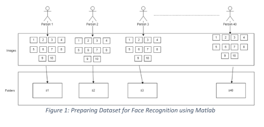

# FACIAL-RECOGNITION-AND-MATCHING-BASED-ON-EIGENVALUE
This project is to improve the face detection system by using Haar Classifier to get higher accuracy result. Haar Classifier is used for face detection because it can detect the desire image very fast. The algorithm has been used for the detection which achieved a higher detection accuracy.

# 1. Data Preprocessing
For the purpose of this project, a dataset of 40 people have been obtained. Each of these people has 10 images with different poses. That means in total there are 40 x 10 = 400 images. For every individual, there is separate folders. Explaining it in this way will create confusion. 

  

In figure 1, we can see in the top row, there are 40 people marked as 1, 2, 3 to 40. Each of them has 10 images. These images are in grayscale. All of these images must have to be of same dimension and resolution. Finally, the images of every individuals are kept into separate folders. In the figure 1, the s1, s2, s3 ….. s40 are representing the folders.

The summary of this process are as follows: 
• 10 images for every person 
• 1 folder for each person (s1, s2, s3 and so on) 
• Images must be in grayscale 
• Images must have to be of same resolution and dimension. I have taken 92 x 112 pixel image.
• The name of the image must have to be numeric such as 1, 2, 3. 
• And the images must have to have same extension such as bmp, pgm and or any image format

# 2. Dataset Loading
After preparing the dataset, the next task is loading the dataset. A Matlab function to load the dataset will be implemented. In this case, it is our load_dataset.m

# 3. Feature Extraction and Face Detection
To recognize the faces, the dataset was loaded first. After that, a random function was used to generate random index. Using the sequence of random index, the loaded images will be recognized later. The rest of the images are also loaded into a separate variable. The code used will be Face_Recognition.m

This program will automatically load an image (unless we choose to load a specific image) and then will find the image of the same person from the image data-set. Using this example, we can design our own face recognition system.

